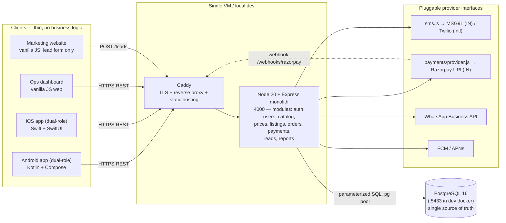
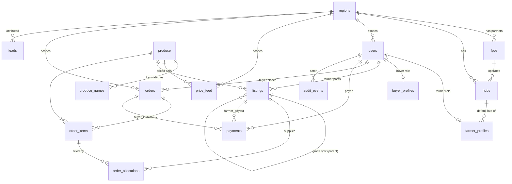
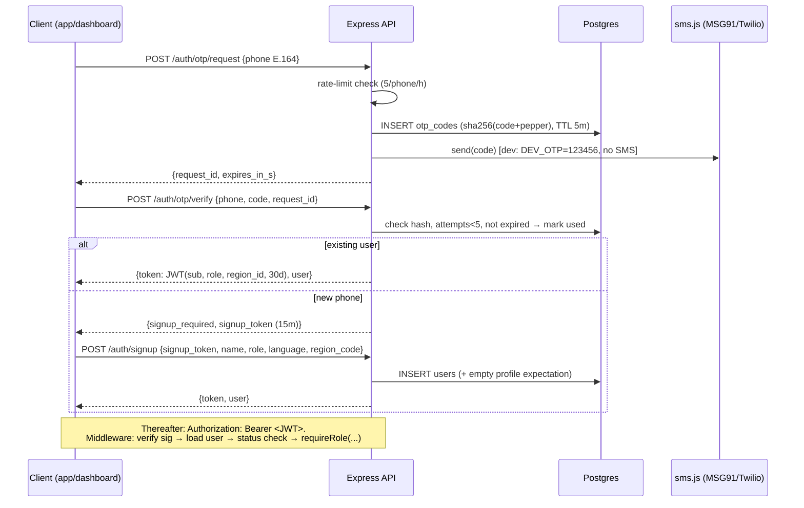

# 11 — Architecture

**Doc owner:** Founder (Alpesh) · **Status:** Draft for founder approval · **Last updated:** 2026-07-12
**Siblings:** `06-PRD-BACKEND.md` (API + DDL detail; this doc explains *why*), `07-PRD-MOBILE-APPS.md`, `08-PRD-WEBSITE.md`, `09-PRD-OPS-DASHBOARD.md` (the four clients), `12-DEVELOPMENT-PLAN.md` (build order), `14-OPS-PLAYBOOK.md` (runbooks referenced by §9–§10), `16-RISKS-MITIGATIONS.md`.

Stack is founder-fixed (see brief): Node.js 20 + Express, PostgreSQL 16, REST JSON snake_case, JWT + phone OTP; vanilla-JS website & ops dashboard; Kotlin/Compose Android; Swift/SwiftUI iOS. This doc does not relitigate the stack; it defines how the pieces fit and how they grow.

---

## 1. System diagram



One backend, one database, four thin clients. Every provider (SMS, payments, messaging, push) sits behind a small interface module so the India instance (MSG91, Razorpay, WhatsApp) is a plug, not a weld — that is what makes country #2 cheap (§7).

## 2. Why one monolith (and when not)

**Decision: a modular monolith — one Express process, one Postgres — until it demonstrably hurts.**

Reasons (all load-bearing, per `06-PRD-BACKEND.md` Non-goals):
1. **Team size = 1.** Every service boundary is a tax on a solo founder: deploys, versioning, tracing across hops. The 2024–25 agritech graveyard (`02-MARKET-RESEARCH.md`) is full of companies that died of burn, not of monoliths.
2. **Transactions are the product.** Order placement, allocation, and payout are cross-"domain" ACID transactions (order + items + allocations + listing status + payment in one commit). In a monolith that's `BEGIN…COMMIT`; in microservices it's sagas and compensation logic — for tens of orders a day.
3. **The scale math is trivial.** Pilot: ~25 buyers × 1 order/day, ~50 farmers × 1 listing/day, ops polling — well under 1 request/second sustained. A 2-vCPU VM is bored.
4. **Modularity lives in the repo, not the network:** `src/routes/*` per module, `src/services/*` for domain logic, provider interfaces per §1. If a split ever happens, the seams already exist.

**Exit triggers (revisit, don't preempt):** sustained p95 > 500 ms after query tuning; a second engineering team; a workload with a genuinely different shape (e.g. image processing for grading photos). First response is always: scale the VM, tune SQL, add read replica — in that order.

## 3. Data model (ERD)

Authoritative DDL in `06-PRD-BACKEND.md` §5. Shape:



Three spines to remember:
- **Geography spine:** `regions → hubs (→ fpos) → farmer_profiles` — every operational fact resolves to a region; nothing global is hardcoded to India.
- **Traceability spine:** `listings → order_allocations → order_items → orders` — the many-to-many that *is* the farm-to-fork differentiator, and the row that carries the freshness SLA chain (§6).
- **Money spine:** `price_feed` (both buyer and farmer prices per day) → `order_items.unit_price` (copied at placement, immutable) → `payments` — farmer-share % is a join, not a spreadsheet.

## 4. Auth flow



Decisions: stateless HS256 JWT (no session store → no Redis); 30-day expiry with re-OTP renewal (acceptable for field users; revisit for refresh tokens when buyer web portal lands); `ops` role never self-registers; blocked users cut off at next request via per-request status check. Full details `06-PRD-BACKEND.md` §6.2, §8.

## 5. Freshness-SLA timestamp chain (the moat metric)

Every `order_allocations` row carries four `timestamptz` (UTC):

```
harvest_ts ──► hub_in_ts ──► dispatch_ts ──► delivered_ts
 (field)        (weigh-in       (3PL leaves     (buyer door;
  derived        at grading,     hub; stamped    stamped by
  at grading)    server now())   on status →     status →
                                 out_for_delivery) delivered)
```

Rules that keep the metric honest (enforced in `06-PRD-BACKEND.md` §6.7, §6.10):
- Timestamps are **server-set** at the moment of the ops action; hub tablet clocks are never trusted.
- Manual backfill (O10) is possible but audited and counted separately — backfilled/incomplete chains are **excluded from medians**, never interpolated.
- Reporting: median + p90 harvest→door per produce and overall (`GET /reports/sla`); target < 36 h, promise < 48 h (Golden rule #5). Weekly ritual consumes it (`14-OPS-PLAYBOOK.md`); a cached public endpoint (`/reports/sla/public`) feeds the website's live counter once ops enables publication (`08-PRD-WEBSITE.md`).
- Why on the *allocation* (not order or listing): one order item can mix crates from multiple farmers with different harvest times, and one listing can feed multiple orders. The allocation is the crate-level truth, so the trace shown to buyers and the SLA math share one row.

## 6. i18n, multi-currency, multi-region — how country #2 onboards

**Design test (in CI, per `06-PRD-BACKEND.md` §9):** insert one `regions` row + seed data for a hypothetical `KE-NAIROBI` (KES, `Africa/Nairobi`, `tax_scheme='none'`, languages `{en,sw}`) and the full API suite must pass with **zero schema migrations**.

The five abstractions that make that true:

| Concern | Mechanism | India instance | Country #2 cost |
|---|---|---|---|
| **Language** | `produce_names(produce_id, lang)` inserts; `users.language` BCP-47; client string tables per language (`07-PRD-MOBILE-APPS.md`); `regions.languages` drives the picker | EN/HI/GU | Translate string tables + produce-name inserts |
| **Currency** | `currency char(3)` on every money table, sourced from `regions.currency`; formatting client-side by currency code; no FX anywhere | INR | One field in the region row |
| **Time** | All storage UTC `timestamptz`; "business date" (prices, delivery dates) computed in `regions.timezone` | Asia/Kolkata | One field in the region row |
| **Tax** | `regions.tax_scheme` selects a module implementing `computeTax(order, region)`; tax lines on the order, no scheme-specific columns | `in_gst` (v1 returns 0 — fresh produce exempt; Q3 in `06-PRD-BACKEND.md`) | Write/choose one module (`none` ships) |
| **Providers** | `sms.js`, `payments/provider.js`, messaging picked **per region** via config map | MSG91, Razorpay UPI, WhatsApp | Config entry + provider adapter if new |
| **Vocabulary** | Generic schema terms (`reference_market_price`); region-flavored words live in UI via `regions.reference_market_label` ("mandi" only as Indian copy) | label = "mandi" | label = local term |

What onboarding country/region #2 actually looks like (runbook to be executed once real): (1) insert region row; (2) seed produce translations + string-table language if new; (3) sign local FPO-equivalent + 3PL (the hard part — it's ops, not software: `13-LAUNCH-PLAN.md`); (4) configure SMS/payout providers for the region; (5) seed ops users + hubs; (6) set daily prices. Users, prices, orders, and reports are region-scoped by the JWT's `region_id` throughout, so tenancy comes free. Cross-region anything (transfers, FX, consolidated invoicing) is explicitly out of scope until a real second region exists.

## 7. Deployment posture

**Stage 0 — now (planning; development paused).** Everything local: Docker Postgres on `:5433`, API on `:4000`, dev OTP `123456`. Nothing public, zero cloud spend (Golden rule: don't pay for cloud before buyers exist — `PLAN.md` heritage, kept).

**Stage 1 — pilot (first real order).**
- One VM (2 vCPU / 4 GB, Mumbai region of any major cloud, ~₹1,500–2,500/mo) running Caddy (TLS, static hosting for website + ops dashboard) + the Node API under systemd.
- Postgres: **managed** from day 1 of production (e.g. smallest managed-PG tier) *or* on-VM with the §9 backup discipline if budget forces it — decision at pilot week −2, owner: founder. Managed preferred: backups and minor upgrades are not founder work.
- Deploy = `git pull && npm ci && migrate && systemctl restart` script; < 1 min downtime window acceptable at pilot (deploys happen 14:00–16:00, never 04:00–09:00 hub hours).
- DNS: `api.` (API), `ops.` (dashboard), apex (website). Secrets in a root-only env file on the VM.

**Stage 2 — scale path (in order, each step only when forced):** move Postgres to managed with PITR (if not already) → bigger VM → second API instance behind the proxy (this is the moment rate limits move from in-process to shared state — the one Redis trigger) → read replica for reports → regional VM for a distant country #2 (latency), still one logical architecture. Kubernetes/microservices remain non-goals until §2's exit triggers fire.

## 8. Observability

Pilot-honest, not aspirational:
- **Structured logs:** `pino` JSON to journald/file — every request logged with `request_id` (uuid, returned as `X-Request-Id` header), user id, role, route, status, latency ms; domain events per `06-PRD-BACKEND.md` §11. PII redaction list enforced in the logger serializer.
- **Health & uptime:** `GET /health` (checks DB ping) watched by a free external monitor (UptimeRobot-class, 1-min interval) → founder phone alert. `GET /version` exposes build + migration level for "what's deployed?".
- **Error visibility:** unhandled errors log stack + request_id and return generic 500; a daily cron greps error-level logs into a WhatsApp summary to the founder. A hosted error tracker (Sentry-class free tier) is a Phase 2 nicety, not MVP.
- **Business observability is product:** the two golden metrics ship as ops report endpoints (R1–R3), reviewed in the weekly ritual (`14-OPS-PLAYBOOK.md`) — no separate BI stack.
- **DB introspection:** `pg_stat_statements` on from day 1; slow-query log at > 200 ms.

## 9. Disaster recovery

| Scenario | Response | Target |
|---|---|---|
| VM dies | Rebuild from provisioning script (versioned in repo: `deploy/provision.sh`) + restore latest dump; DNS unchanged | RTO ≤ 4 h |
| DB corruption / bad migration | Restore last nightly dump to scratch, verify, promote; migrations are forward-only numbered SQL — bad ones fixed by a new migration, never edited | RPO ≤ 24 h (pilot); ≤ 5 min after managed-PG PITR (Stage 2) |
| Secrets leak (JWT/OTP pepper) | Rotate env secrets → all sessions invalidate → users re-OTP (cheap by design); audit payout rows since leak window | Same day |
| Provider outage (SMS/Razorpay/WhatsApp) | Degrade to manual: dev-ops can read OTP from server log for a stuck staff login; payouts fall back to `provider='manual'` + bank UPI; comms fall back to phone calls | Zero deliveries blocked (software never blocks a delivery — `09-PRD-OPS-DASHBOARD.md` §1) |
| Founder's laptop lost | Nothing production lives on it: repo on GitHub (private), secrets on VM, DB in cloud | — |

Backup discipline (detail in `06-PRD-BACKEND.md` §8): nightly encrypted `pg_dump` off-host, 30-day retention + 12 weekly; **monthly restore drill** logged in `14-OPS-PLAYBOOK.md` — an untested backup is a rumor. The drill is a calendar event, not an intention.

## 10. Cross-cutting invariants (the checklist any code review enforces)

1. No client-supplied money values are ever trusted — prices and totals computed server-side (`06-PRD-BACKEND.md` §6.7).
2. Every table that touches money/time/language/geo carries `currency`/`timestamptz`/BCP-47/`region_id` respectively.
3. `reference_market_price` in code and schema; "mandi" only in Indian UI strings.
4. All lifecycle transitions are compare-and-set SQL guarded and 409 on violation.
5. Every ops mutation writes `audit_events`.
6. Data layer = **Knex + Objection.js** (Fancall canon, [20-CODE-ARCHITECTURE.md](20-CODE-ARCHITECTURE.md) §1): Knex migrations + query builder, Objection models over an `AppModel` base (soft-delete + timestamps). Parameterized/bound queries only — never string-built SQL. (Supersedes the earlier raw-`pg` note.)
7. Providers only behind interfaces; no `require('razorpay')` outside `payments/`.
8. The CI region-#2 test (§6) stays green forever.

## 11. Open questions (owner + deadline)

| # | Question | Provisional decision | Owner | Deadline |
|---|---|---|---|---|
| Q1 | Managed Postgres vs on-VM at pilot | Managed, unless monthly infra budget must stay < ₹3k | Founder | Pilot week −2 |
| Q2 | Cloud vendor for Stage 1 | Any major with Mumbai region; pick by cheapest 2vCPU+managed-PG combo at decision time | Founder | Pilot week −2 |
| Q3 | Error tracker (Sentry-class) at MVP | No — log-grep cron suffices at pilot volume | Founder | Phase 2 |
| Q4 | When ops dashboard + website move off the API VM to static/CDN hosting | When VM CPU or deploy coupling annoys; not before | Founder | Stage 2 trigger |
